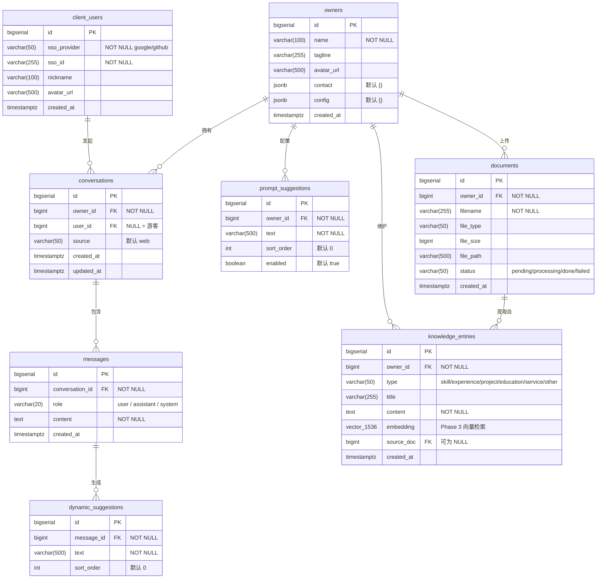

# 数据库表设计 UML

---

## 表关系说明

| 关系 | 类型 | 说明 |
|------|------|------|
| owners → conversations | 1 : N | 一个 Owner 下有多个对话会话 |
| owners → prompt_suggestions | 1 : N | Owner 在管理端配置首屏初始提示词 |
| owners → knowledge_entries | 1 : N | Owner 维护的知识库条目 |
| owners → documents | 1 : N | Owner 上传的原始文件 |
| client_users → conversations | 1 : N | 已登录用户发起的对话（游客时 user_id = NULL）|
| conversations → messages | 1 : N | 一个会话包含多条消息 |
| messages → dynamic_suggestions | 1 : N | 每条 assistant 消息生成 2~4 条动态提示词 |
| documents → knowledge_entries | 1 : N | 一个文件可提取多条知识条目（source_doc 可为 NULL，表示手动录入） |

---

## 关键索引

| 索引名 | 表 | 列 | 类型 | 用途 |
|--------|----|----|------|------|
| `idx_knowledge_entries_embedding` | knowledge_entries | embedding | HNSW (cosine) | Phase 3 向量相似度检索 |
| `idx_messages_conversation_id` | messages | conversation_id, created_at | B-tree | 按会话加载历史消息 |
| `idx_knowledge_entries_owner_id` | knowledge_entries | owner_id | B-tree | 按 Owner 筛选知识条目 |
| `idx_prompt_suggestions_owner_id` | prompt_suggestions | owner_id, sort_order | B-tree | 首屏提示词排序查询 |
| `idx_conversations_owner_id` | conversations | owner_id | B-tree | 管理端查看会话列表 |
| UNIQUE (sso_provider, sso_id) | client_users | — | Unique | 防止 SSO 用户重复注册 |
