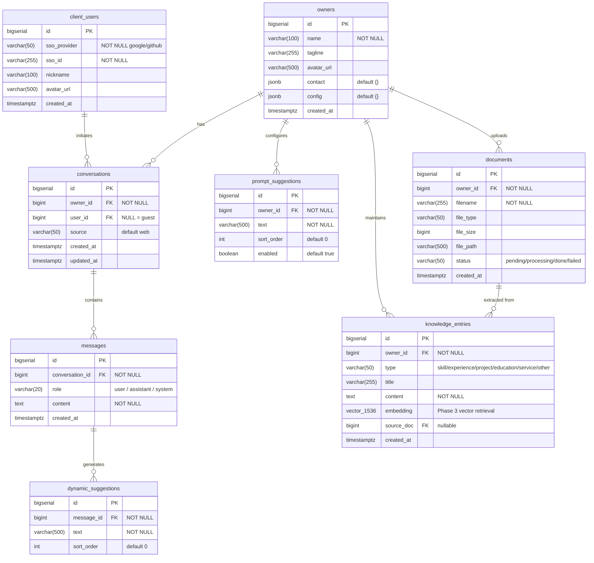

# Dossier - Database Schema UML

---

## Table Relationships

| Relationship | Type | Description |
|--------------|------|-------------|
| owners → conversations | 1 : N | One owner has multiple conversation sessions |
| owners → prompt_suggestions | 1 : N | Owner configures initial home-screen suggestions in the admin console |
| owners → knowledge_entries | 1 : N | Knowledge base entries maintained by the owner |
| owners → documents | 1 : N | Files uploaded by the owner |
| client_users → conversations | 1 : N | Conversations initiated by logged-in users (guest: user_id = NULL) |
| conversations → messages | 1 : N | A conversation contains multiple messages |
| messages → dynamic_suggestions | 1 : N | Each assistant message generates 2–4 dynamic follow-up suggestions |
| documents → knowledge_entries | 1 : N | One file can yield multiple knowledge entries (source_doc nullable = manually entered) |

---

## Key Indexes

| Index Name | Table | Column(s) | Type | Purpose |
|------------|-------|-----------|------|---------|
| `idx_knowledge_entries_embedding` | knowledge_entries | embedding | HNSW (cosine) | Phase 3 vector similarity search |
| `idx_messages_conversation_id` | messages | conversation_id, created_at | B-tree | Load message history by conversation |
| `idx_knowledge_entries_owner_id` | knowledge_entries | owner_id | B-tree | Filter knowledge entries by owner |
| `idx_prompt_suggestions_owner_id` | prompt_suggestions | owner_id, sort_order | B-tree | Sorted query for home-screen suggestions |
| `idx_conversations_owner_id` | conversations | owner_id | B-tree | Admin console conversation list |
| UNIQUE (sso_provider, sso_id) | client_users | — | Unique | Prevent duplicate SSO user registration |
